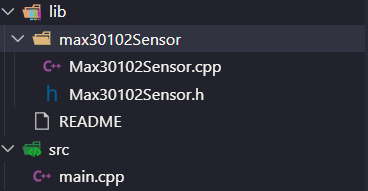

# Thiết bị đo nhịp tim và SpO2 trong máu - Kết hợp MLAI dự đoán nguy cơ mắc bệnh rối loạn tim mạch

## Code tìm địa chỉ I2C

```cpp
#include <Arduino.h>

#include <Wire.h>

void setup() {
  Serial.begin(115200);
  Wire.begin(D2, D1); // SDA = D2 (GPIO4), SCL = D1 (GPIO5) trên NodeMCU ESP8266
  Serial.println("\nI2C Scanner bắt đầu...");
}

void loop() {
  byte error, address;
  int nDevices;

  Serial.println("Đang quét...");

  nDevices = 0;
  for(address = 1; address < 127; address++ ) {
    Wire.beginTransmission(address);
    error = Wire.endTransmission();

    if (error == 0) {
      Serial.print("Thiết bị I2C tìm thấy tại địa chỉ 0x");
      if (address < 16)
        Serial.print("0");
      Serial.print(address, HEX);
      Serial.println(" !");

      nDevices++;
    }
    else if (error == 4) {
      Serial.print("Lỗi không xác định tại địa chỉ 0x");
      if (address < 16)
        Serial.print("0");
      Serial.println(address, HEX);
    }    
  }
  if (nDevices == 0)
    Serial.println("Không tìm thấy thiết bị I2C nào\n");
  else
    Serial.println("Hoàn tất quét\n");

  delay(3000); // quét lại sau 3 giây
}
```

## Video mẫu lấy ý tưởng và code

[Xem video tại đây](https://www.youtube.com/watch?v=aC3chjvsgx0)

[Xem code mẫu tham khảo tại đây](https://electechoz.blogspot.com/2024/11/diy-max30102-heart-health-monitor-using.html)

## Các module đều được phát triển trong lib/

## Code module ESP8266 NodeMCU giao tiếp MAX30102 đo nhịp tim và SpO2

### Cài đặt thư viện giao tiếp MAX30102

- SparkFun MAX3010x Pulse and Proximity Sensor Library by SparkFun Electronics

### Tổ chức folder

- Tổ chức Folder như hình



### Code giao tiếp

- Dùng bộ lọc tín hiệu + thuật toán nhận đỉnh (peak detector) để tính nhịp tim.

- Có thể thay bằng dùng thuật toán Maxim reference (maxim_heart_rate_and_oxygen_saturation) — nó mạnh hơn, đã dùng rộng rãi, muốn có độ chính xác cao hơn cho HR & SpO₂.

- Xem nội dung code trong các file tương ứng

## Kết nối Firebase

[Xem video hướng dẫn 1 tại đây](https://www.youtube.com/watch?v=CsLBrwgPEEU)

[Hoặc video hướng dẫn 2 tại đây](https://www.youtube.com/watch?v=0LYmD8jv7xo&t=1401s)

### Cài thư viện kết nối Firebase

- Firebase Arduino Client Library for ESP8266 and ESP32 by Mobizt

### Code liên kết với Firebase Realtime Database

- Tạo 1 file config.h trong folder common và thêm các nội dung như file mẫu config.h.exammple

- Xem nội dung trong các file code

## Có dùng dùng NTP (lấy giờ Internet)

## Dùng Teleplot trong PlatformIO để xem đồ thị

[Xem hướng dẫn tại đây](https://www.youtube.com/watch?v=aC9VDMIO9XU)

## Module buttonPower bật/tắt thiết bị

- Module được phát triển trong lib/buttonPower điều khiển 1 LED báo trạng thái của thiết bị và 1 button để bật/tắt thiết bị

- button dùng ngắt ngoài để xử lý và có xử lý debouce
