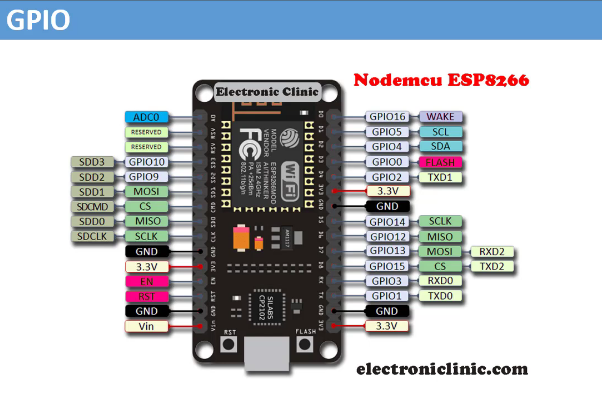
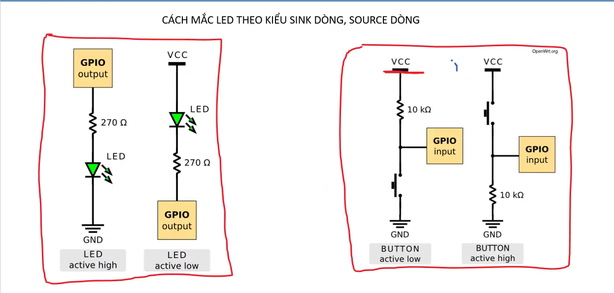

# GPIO TRÊN ESP8266

- GPIO : viết tắt của General Purpose Input Output



- Các chân GPIO trên board có thể có chức năng là INPUT/OUTPUT

- Board ESP8266 NodeMCU không thể hiểu được mức điện áp là 3.3V và 0V. Nó chỉ hiểu là mức cao (HIGH) và mức thấp (LOW).

- Nếu mức điện áp dao động ở khoảng 2.1 - 3.3V thì GPIO xuất mức cao.

- Nếu mức điện áp dao động ở khoảng 0 - 0.1V thì GPIO xuất mức thấp.

## Các API chuẩn làm việc với GPIO

### `pinMode`

- Là API dùng để cấu hình chức năng cho chân GPIO đó là INPUT/OUTPUT

- Cú pháp:

```cpp
pinMode(chân_GPIO, MODE);
```

- Với MODE:
  - INPUT : nếu chân GPIO này có chức năng đọc dữ liệu từ bên ngoài.
    - INPUT_PULLUP : kích hoạt chức năng đọc dữ liệu từ bên ngoài vào và bật điện trở kéo lên (mức cao) có sẵn trong board ESP8266.
    - INPUT_PULLDOWN : kích hoạt chức năng đọc dữ liệu từ bên ngoài vào và bật điện trở kéo xuống (mức thấp) có sẵn trong board ESP8266.

    

  - OUTPUT : nếu chân GPIO này có chức năng ghi dữ liệu ra bên ngoài.

### `digitalWrite`

- Là API chuẩn dùng để ghi 1 mức điện áp ra chân GPIO

- Cú pháp:

```cpp
digitalWrite(chân_GPIO, LEVEL);
```

- Với LEVEL:
  - HIGH : Xuất điện áp mức cao (HIGH).
  - LOW : Xuất điện áp mức thấp (LOW).

### `digitalRead`

- Là API chuẩn dùng để đọc dữ liệu từ bên ngoài thông qua chân GPIO

- Cú pháp:

```cpp
digitalRead(chân_GPIO);
```
