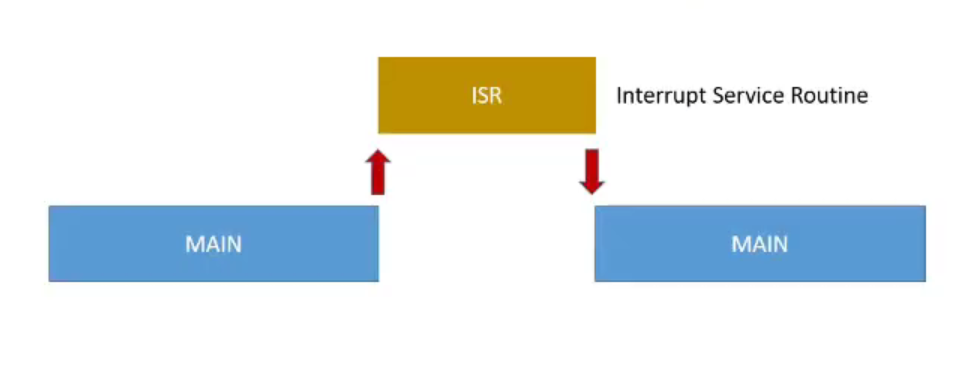
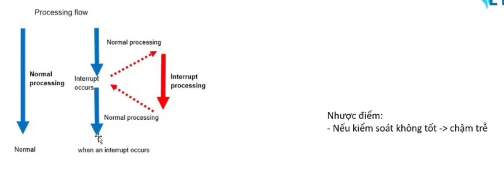
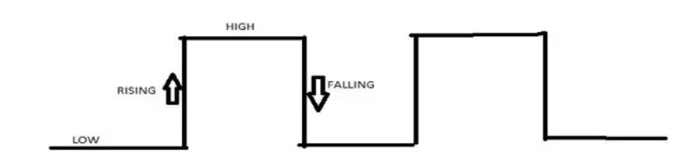

# NGẮT TRÊN ESP8266

## Giới thiệu về ngắt

- `Ngắt (Interrupt)` có thể hiểu là 1 tín hiệu khẩn cấp gửi đến bộ VXL, yêu cầu bộ VXL tạm dừng các công việc đang được thực hiện để nhảy đến 1 nơi khác thực hiện 1 chương trình khác (công việc khác). Chương trình này được gọi là trình phục vụ ngắt (ISR: Interrupt Service Routine). Sau khi kết thúc chương trình trong ngắt, VXL xử quay về vị trí trước đó để thực hiện tiếp nhiệm vụ còn đang dang dở.





## Các chế độ ngắt - Ngắt ngoài

- Khi có sự chuyển đổi mức logic trên chân ngắt thì 1 sự kiện ngắt sẽ xảy ra.

- Có 2 chế độ ngắt ngoài:
  - RISING: Đang ở mức thấp đột ngột chuyển sang mức cao
  - FAILLING : Đang ở mức cao đột ngột chuyển sang mức thấp



## Ngắt trong VDK ESP8266

- **Lưu ý: các GPIO có liên quan đến boot thì không nên cấu hình ngắt**

### Các API chuẩn cho ngắt

#### `digitalPinToInterrupt`

- Là API chuẩn dùng để chuyển 1 chân GPIO bình thường thành GPIO ngắt

- Cú pháp:

```cpp
digitalPinToInterrupt(GPIO_ngắt);
```

#### `attachInterrupt`

- Là API dùng để setup, khởi tạo ngắt

- Cú pháp:

```cpp
attachInterrupt(pinMode_ngắt, Function_ngắt, Mode_ngắt);
```

- Với :
  - pinMode_ngắt: mức ngắt của chân ngắt trong hệ thống
    - Hàm digitalPinToInterrupt(pin) sẽ tra cứu bảng ánh xạ của board hiện tại,
để biết chân GPIO_ngắt tương ứng với ngắt số mấy (0,1,2,...) trong vi điều khiển.
  - Function_ngắt (ISR): là hàm được dùng để thực hiện công việc ngắt
  - Mode_ngắt: là lựa chọn ngắt theo RISING/FALLING

#### `void IRAM_ATTR`

- được dùng để định nghĩa 1 Function_ngắt

- `IRAM_ATTR` : đảm bảo hàm được đặt trong bộ nhớ RAM nội bộ (IRAM) để tăng tốc độ truy cập khi xử lý ngắt

- Cú pháp:

```cpp
void IRAM_ATTR Function_ngắt(){
 // do something when interupt happen
}
```

#### Lưu ý

- **Khuyến khích dùng lệnh vừa chuyển GPIO sang ngắt là đăng ký ngắt cho GPIO đó luôn**

- Cú pháp:

```cpp
attachInterrupt(digitalPinToInterrupt(GPIO_ngắt), ISR, Mode_ngắt);
```

- **Trong ISR, không nên xử lý quá lâu (vd: delay dài, đọc cảm biến,...) sẽ làm hệ thống không ổn định**

- **Nếu được có thể hãy tạo ra biến cờ để quản lý**

## Bài tập

Ngắt ngoài dùng Button nối với GPIO 14, ngắt chế độ FALLING.

Mỗi khi nhấn button thì sẽ in ra dòng chữ Interrupt actved! lên màn hình monitor

Cấu hình cho GPIO 14 luôn mức 1.

Ngắt được xảy ra khi có tác động mức thấp.

[Xem source code tại đây](./InterruptOnESP8266/src/main.cpp)
