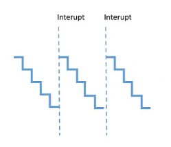

# TIMER TRONG ESP8266

- Là 1 bộ định thời

## Giới thiệu về Timer

- ESP8266 có **1 bộ đếm Timer phần cứng (Hardware Timer) duy nhất**, được gọi là `Timer1`

- Tần số gốc của Timer : 80 Mhz (ở chế độ xung nhịp tiêu chuẩn)

- Bộ đếm là 23 bit, giá trị đếm đến 2^(23) - 1

- Bộ đếm hoạt động ở chế độ đếm ngược (down-counter)

- Timer có thể chia xung nhịp (clock divider) để giảm tần số `(Chia tần)`:

  - `TIM_DIV1`: không chia xung, tần số 80 Mhz

  - `TIM_DIV16`: chia 16, tần số 5 Mhz

  - `TIM_DIV256`: chia 256, tần số 312.5 kHz

## Cơ chế



- Bước 1: Xác định tần số của `Timer`

  - Timer hoạt động theo cơ chế đếm xuống, `giá trị sẽ được đếm` từ `tần số set cho Timer ba đầu`, `mỗi lần giảm 1 giá trị đếm xuống` gọi là `1 tick`, và khi `tick giảm về 0` sẽ kích hoạt `1 ngắt`, ngắt thực thi thì `Timer` sẽ được `reset` đếm lại từ đầu.

- Bước 2: Xác định thời gian mỗi tick

  - Tần số hệ thống `f`: là trong 1 giây hệ thống thực hiện `f` xung clock.

  - Bộ chia tần sinh ra để tính toán thời gian mỗi tick trong hệ thống

  - **Ví dụ: với f = 5 Mhz => 1 tick = 1 / 5 Mhz => 5M tick = 1s**

  - Ứng dụng: ví dụ có 1 function cứ 0.5s sẽ thực thi 1 lần. Mình dùng Timer để thực thi thay vì delay (delay sẽ làm hệ thống trì trệ) thì cần 2.5M tick sẽ thực thi function.

- Bước 3: Xác định thời gian mỗi ngắt

## Timer trong VDK ESP8266

- Có các API chuẩn cho Timer trong ESP8266

### `timer1_attachInterrupt()`

- Là API dùng để thiết lập function ngắt (ISR)

- Cú pháp:

```cpp
timer1_attachInterrupt(ISR);
```

### `timer1_enable()`

- Là API dùng để thiết lập thông số của Timer

- Cú pháp:

```cpp
timer1_enable(Bộ_chia_tần, TIM_EDGE, Mode_ngắt);
```

- Với :

  - Bộ_chia_tần : có 3 bộ chia được nếu ra ở trên.

  - TIM_EDGE :

  - Mode_ngắt : thường là `TIM_LOOP`, là cơ chế lựa chọn cho phép khi ngắt xảy ra thì timer sẽ được reset lại đếm từ giá trị ngưỡng

### `timer1_write()`

- Là API dùng để thiết lập thời gian ngắt

- Cú pháp:

```cpp
timer1_write(số_tick);
```

- Với :

  - số_tick : là giá trị ngưỡng của tần số. Đây là giá trị bắt đầu đếm xuống, giá trị này tương ứng với bộ_chia_tần

### ISR

- Là function ngắt

- Luôn dùng IRAM_ATTR để đưa hàm này vào trong IRAM để thực thi chương trình nhanh hơn.

- Cú pháp:

```cpp
void IRAM_ATTR ISR() {

}
```

[Xem source code tại đây để hiểu thêm](./TimerOnESP8266/src/main.cpp)
