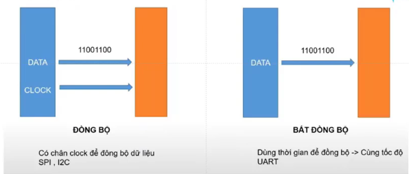
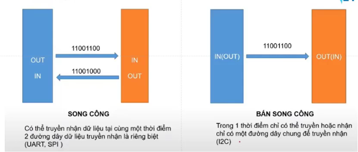

# GIAO TIẾP TRONG VI ĐIỀU KHIỂN - CÁC GIAO THỨC UART, SPI, I2C, v.v

Nếu dùng 1 board VDK để điều khiển nhiều lúc nhiều cảm biến. Điều này có thể gây khó khăn trong quá trình điều khiển hệ thống.

Có thể chia nhỏ hệ thống ra thành nhiều module khác nhau, mỗi module được điều khiển bằng 1 VDK.

Các VDK trong các module sẽ đọc, điều khiển các cảm biến, thiết bị,... sau đó gửi về 1 module chính bằng các giao thức như `UART, SPI, I2C, v.v`

## Giao tiếp

### 1. Phân loại

- Phân loại theo cách truyền bit

> Thường trong các VDK chỉ dùng giao tiếp nối tiếp.

- Phân loại theo truyền đồng bộ / bất đồng bộ

- Phân loại theo truyền song công / bán song công

